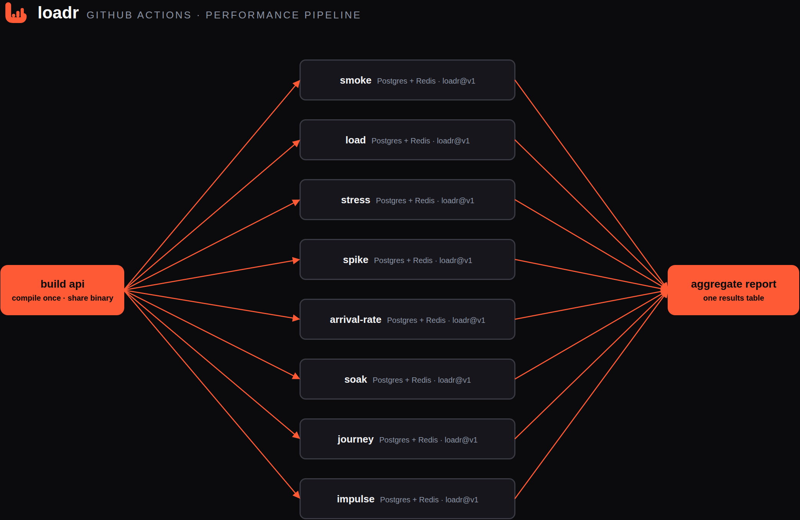
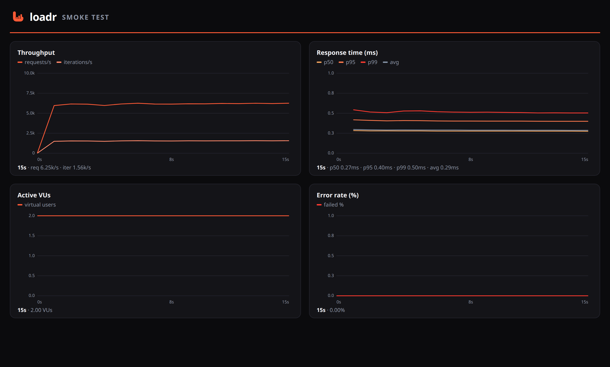
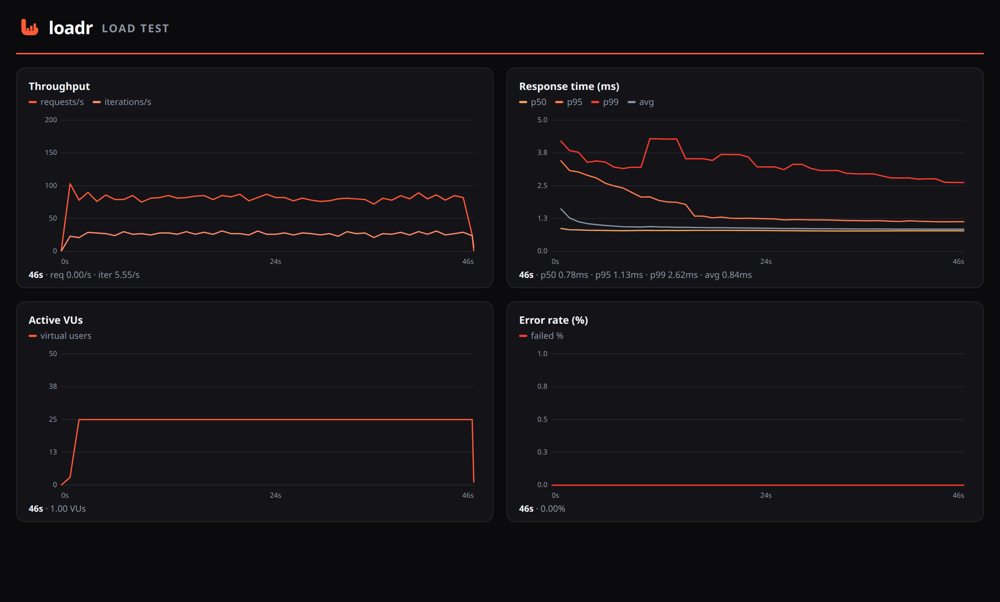
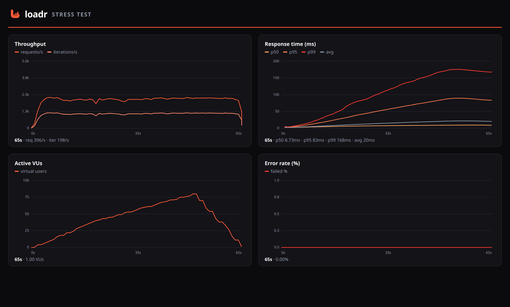
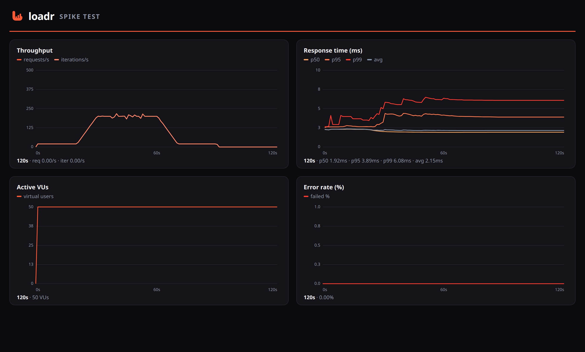
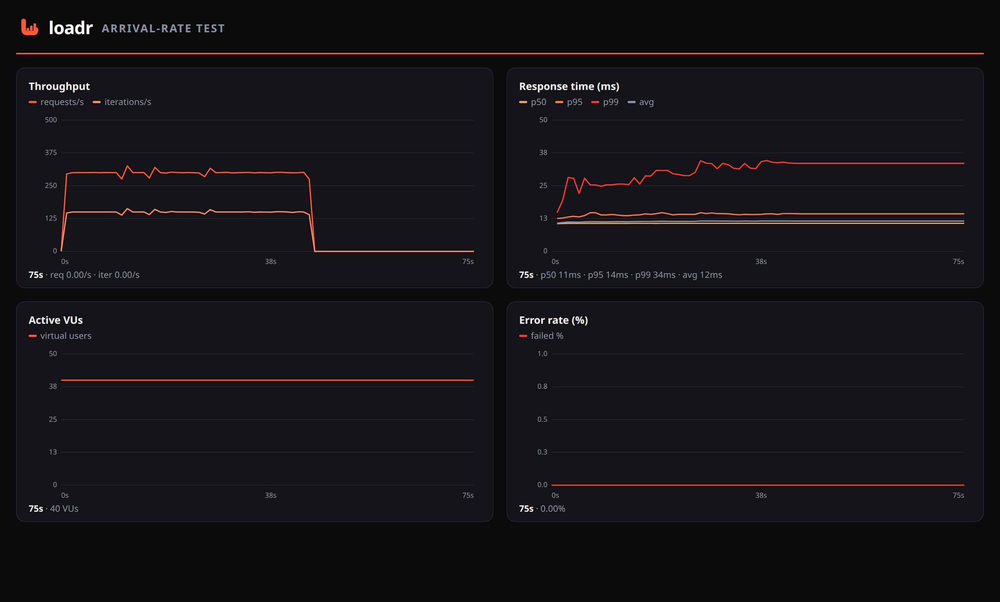
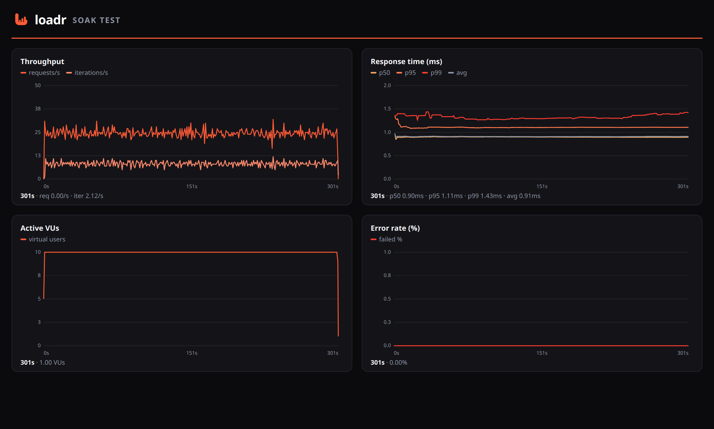
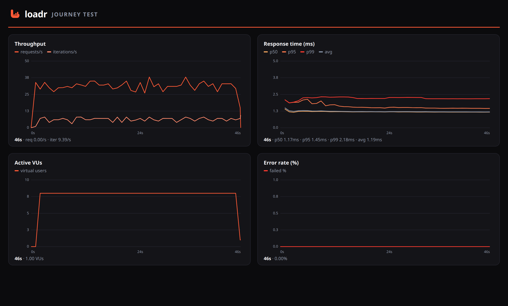
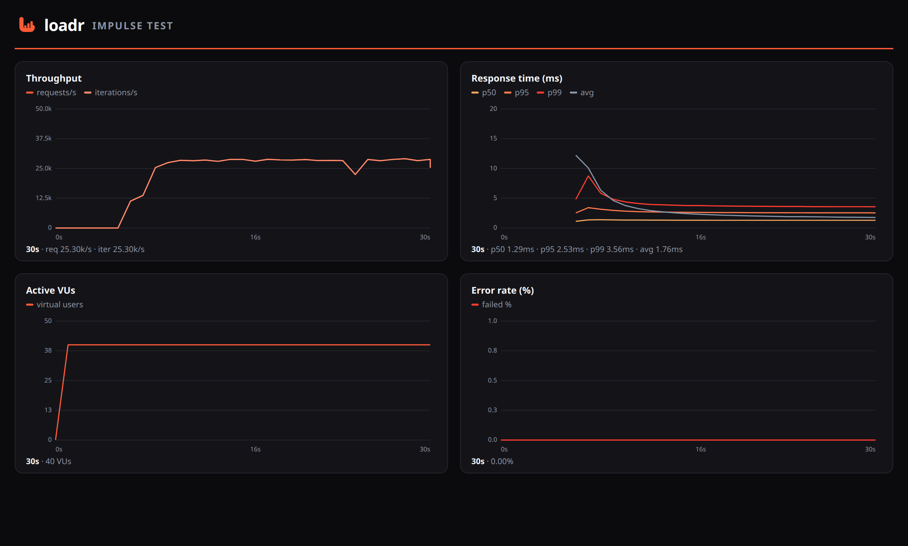

# loadr-demos

A complete, runnable example of performance-testing a real service with
[**loadr**](https://github.com/levantar-ai/loadr) inside GitHub Actions.

It ships:

- a small **Go + Postgres + Redis** storefront API (routes, a database, auth, an
  order transaction, a cache-backed heavy report, plus deliberate CPU-bound and
  slow endpoints), and
- a **GitHub Actions** pipeline that builds the API once and then fans out into
  **eight performance tests running in parallel** — each on its own runner with
  its own throwaway Postgres + Redis — surfacing JUnit results in the Checks tab
  and a combined table on the run summary.

> [!IMPORTANT]
> **This repository is for demonstration purposes only.** The app is a toy, the
> thresholds are illustrative, and the test parameters are deliberately small so
> the whole suite finishes in a few minutes on a free GitHub runner. It exists to
> show *how* to wire loadr into CI and *what the different kinds of load test look
> like* — not as a production service or a tuning baseline. The graphs below come
> from local runs, so the **curve shapes are real but the absolute numbers
> reflect the machine they ran on**, not your target environment.

---

## The pipeline



A single `build` job compiles the API once; the `perf` matrix then runs all
eight test types **in parallel** (each on its own runner with its own Postgres +
Redis), and a final `report` job stitches the summaries together.

Each perf job spins up `postgres:16` + `redis:7` **service containers**, starts
the API (it migrates + seeds on boot), then installs and runs loadr via the
first-party action:

```yaml
- uses: levantar-ai/loadr@v1
  with:
    plan: perf/${{ matrix.test }}.yaml
    version: latest
    junit: ${{ matrix.test }}-junit.xml
    summary: ${{ matrix.test }}-summary.json
```

It publishes the JUnit report to the **Checks** tab (`dorny/test-reporter`) and
uploads the JSON summary for the aggregate `report` job. A breached
[threshold](https://github.com/levantar-ai/loadr) fails the job (loadr exits
non-zero), so a performance regression breaks the build like any other test.
`fail-fast: false` means one failing test type never cancels the rest. See
[`.github/workflows/perf.yml`](.github/workflows/perf.yml).

---

## The test types

Eight plans (in [`perf/`](perf/)), each a different executor / failure mode.
The graphs are loadr's own HTML-report charts; watch the **shape** — it's the
fingerprint of each test.

### 🔹 smoke — the fast gate
`constant-vus`, 2 VUs, 15s. A handful of requests across the core read paths
with strict checks. If this fails the build is broken; the heavier stages don't
bother running for real. Flat, minimal load.



### 🔹 load — steady expected traffic
`constant-vus`, 25 VUs, 45s, with human-like think time. The "does it hold up at
normal load" baseline — a flat plateau of concurrency browsing the catalog
(list → detail → search). Asserts p95/p99 latency budgets.



### 🔹 stress — find the knee
`ramping-vus`, 0 → 40 → 80 → 0. A triangular ramp that pushes concurrency past
comfortable levels against the CPU-bound `/api/compute` path to find where
latency turns up. `abort_on_fail` kills the run if errors run away.



> **Why does throughput stay flat while VUs and latency climb?** That flat line
> *is* the result. The server saturates early (~10 VUs maxes the CPU and the
> 20-connection DB pool), so it can't *complete* requests any faster — throughput
> pins at its ceiling (~2.2k req/s here). Every extra VU past that knee doesn't
> add throughput, it just joins the queue, so response time rises instead. It's
> Little's Law — `concurrency = throughput × latency`: with throughput capped,
> driving concurrency up forces latency up. Finding that knee is the point of a
> stress test.

### 🔹 spike — a sudden surge
`ramping-arrival-rate`, 20 → **200** → 20 orders/sec (open model). A calm
baseline, a sharp 10× spike of order writes, then recovery. The throughput chart
shows the spike directly; latency balloons at the peak and should settle after.



### 🔹 arrival-rate — throughput & saturation
`constant-arrival-rate`, 150 req/s, 45s (open model). Pins a fixed request rate
independent of response time, so saturation shows up as `dropped_iterations` and
rising p99 rather than as fewer requests. A flat throughput line.



### 🔹 soak — leaks & drift (mini soak)
`constant-vus`, 10 VUs, **5 minutes**. Moderate steady load held long enough to
surface slow leaks, connection-pool exhaustion or latency drift. The curve
should stay flat for the whole run — drift is the smell. (In anger you'd hold
this for hours; 5 min keeps CI honest.)



### 🔹 journey — a realistic user flow
`constant-vus`, 8 VUs. An end-to-end authenticated journey that chains requests:
login → **extract** bearer token → browse → **correlate** a sku → create a
product (authed) → place an order → verify it. Uses a CSV **data feeder** for
credentials. This one is about features, not curve shape: feeders, extraction
and correlation.



### 🔹 impulse — cold-start under load
`constant-vus`, **40 VUs from t=0, no ramp, cold cache**. The opposite of a ramp.
It slams the expensive, Redis-cached `/api/reports/top-sellers` endpoint at full
concurrency the instant the test starts. Because the cache is empty, all 40 VUs
miss at once and stampede the heavy DB aggregation (a *thundering herd*):
**throughput is pinned near zero while the herd is cold, then surges the moment
the cache warms** — and latency spikes at t=0 and collapses. That sudden
step-change, rather than a gentle climb, is the impulse signature.



---

## The API

A storefront on Go's standard-library router, backed by Postgres (`pgx`) with an
optional Redis cache.

| Method & route | Description |
|---|---|
| `GET /healthz` / `GET /readyz` | liveness / readiness (readiness pings the DB) |
| `GET /api/products?q=&limit=&offset=` | list/search the catalog (reads DB) |
| `GET /api/products/{id}` | product detail |
| `POST /api/products` | create a product — **requires `Authorization: Bearer …`** |
| `POST /api/orders` | place an order — priced + stock-decremented in **one transaction** |
| `GET /api/orders/{id}` | fetch an order + its line items |
| `GET /api/reports/top-sellers` | **expensive aggregation, cached in Redis** (cold = slow DB query, warm = cache hit; `X-Cache: HIT/MISS`) |
| `POST /api/auth/login` | returns a bearer token (demo auth) |
| `GET /api/compute?n=` | CPU-bound (SHA-256 ×n) — latency rises with load |
| `GET /api/slow?ms=` | controllable latency |

Redis is optional: with no `REDIS_URL` the cache degrades to a no-op (every call
is a miss) and everything still runs — the impulse test just won't show a warm
phase. Source: [`cmd/api`](cmd/api), [`internal/server`](internal/server),
[`internal/store`](internal/store), [`internal/cache`](internal/cache).

## Run it locally

Prereqs: Go 1.24+, Docker, and the [loadr CLI](https://github.com/levantar-ai/loadr#install).

```bash
make db                       # start Postgres + Redis in Docker
make api                      # run the API on :8080 (migrates + seeds on boot)

# in another shell — run a plan against it:
make perf PLAN=impulse        # or: smoke, load, stress, spike, arrival-rate, soak, journey
make perf-all                 # run them all sequentially

make test                     # go unit tests
make clean                    # stop the services, remove artifacts
```

Or drive loadr directly and open the same HTML report the graphs come from:

```bash
BASE_URL=http://localhost:8080 loadr run perf/impulse.yaml --summary-export impulse.json
loadr report impulse.json -o impulse.html && open impulse.html
```

## License

MIT — see [LICENSE](LICENSE). Built to demonstrate
[loadr](https://github.com/levantar-ai/loadr).
