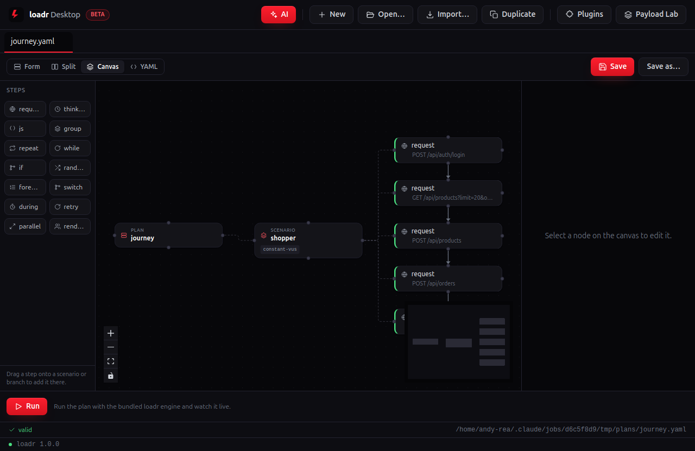
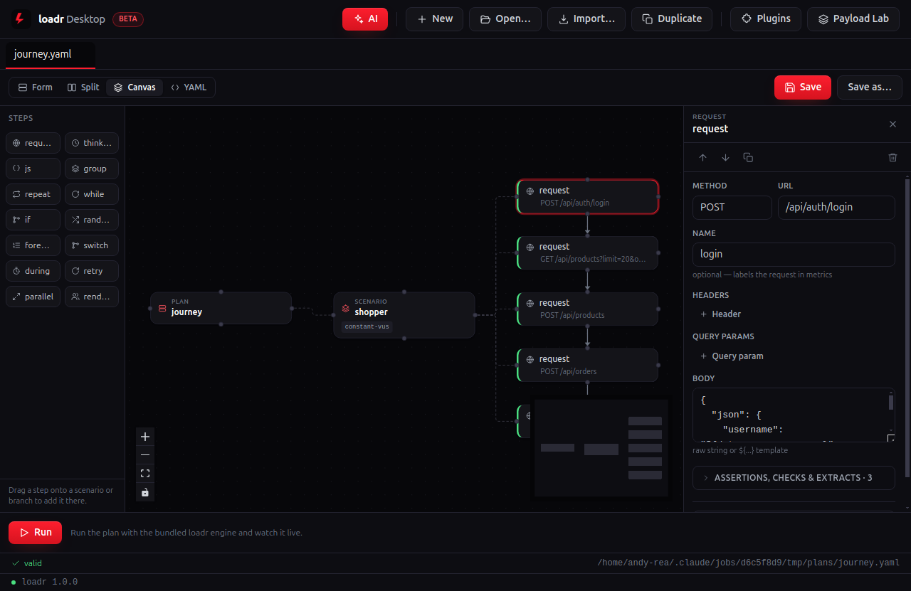
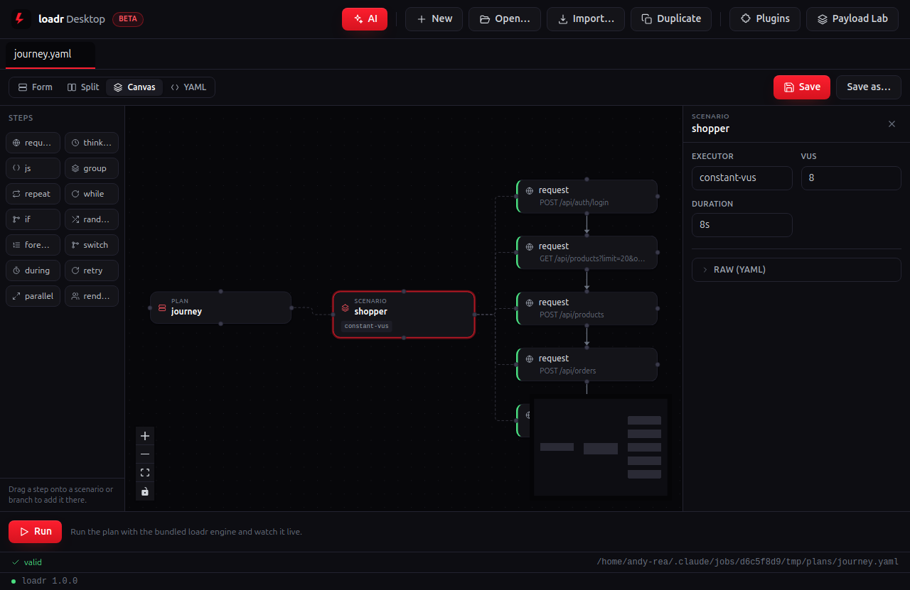
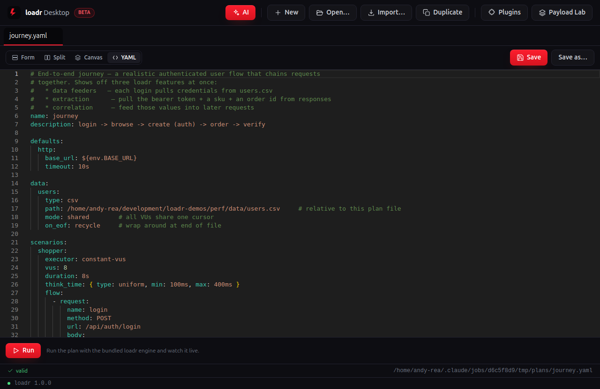
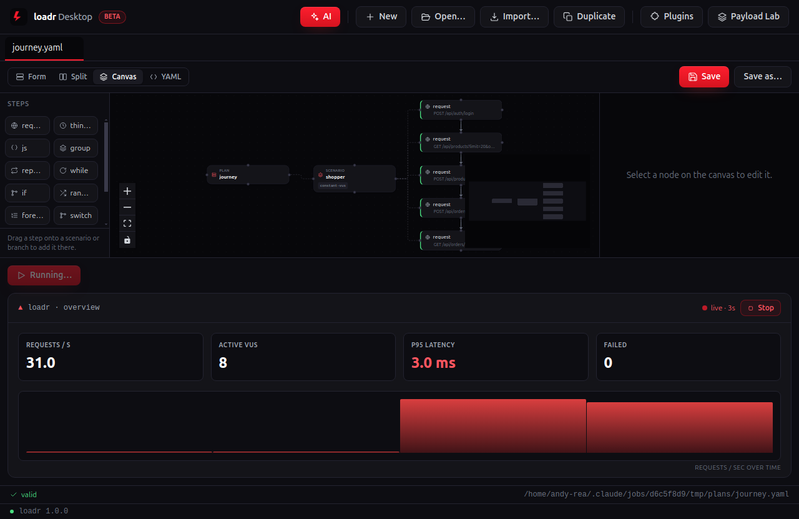
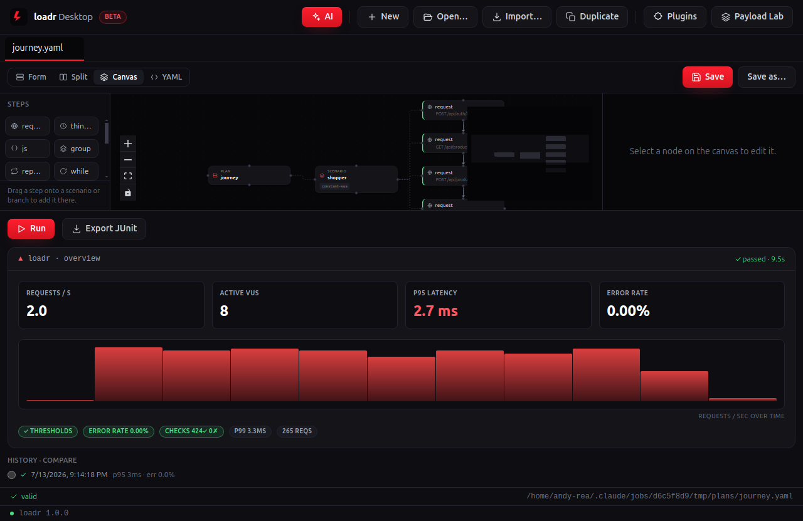
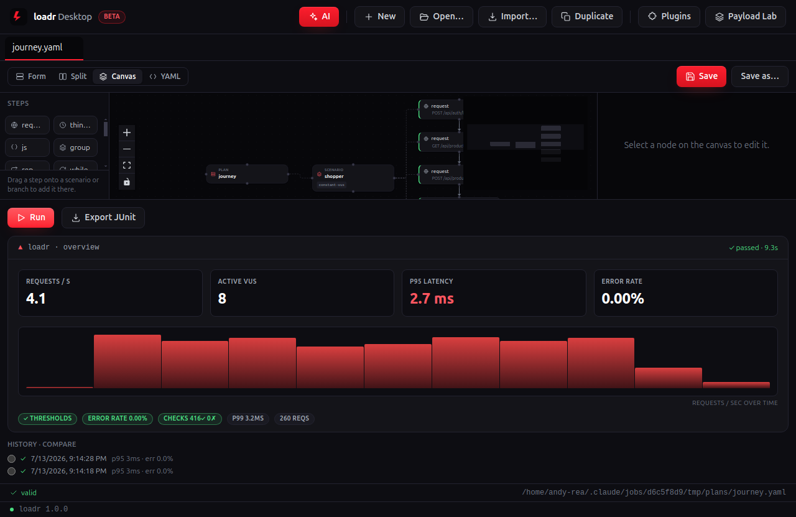

# journey — desktop walkthrough

**A realistic user, end to end.** Three loadr features at once — **data feeders** (each login pulls credentials from a CSV), **extraction** (pull the bearer token, a SKU and an order id from responses), and **correlation** (feed those back into later requests). This is where the inspector earns its keep.

| Screenshot | What's happening |
|---|---|
|  | **Open the plan into the Canvas.** The plan renders as a drag-and-drop node graph — `PLAN ▸ SCENARIO ▸` its steps — with the step palette on the left. The flow is a chain of requests — login, browse, create, order, verify — each feeding the next. |
|  | **Click a request node.** Its full GUI form opens in the inspector — method, URL, headers, body, and the checks/extracts. No YAML required. Open the `login` request to see the CSV-fed body and the `token` **extract**; later requests reference `${token}` — correlation, visualised. |
|  | **Click the scenario node.** The workload shape is a form too — the executor and its parameters, right where you dial the load. `constant-vus` shoppers, each running the full chain with think time between steps. |
|  | **Flip to YAML.** Always in sync with the canvas and byte-for-byte what `loadr run` executes in CI — `base_url` stays an `${env.BASE_URL}` reference. The desktop app is a lens over the same engine, not a re-implementation. |
|  | **Hit Run.** loadr Desktop drives the plan against the live storefront with the bundled engine while the graph stays in view; metrics stream in real time. Every VU walks the whole journey; failures here mean a broken step in the chain. |
|  | **Read the verdict.** Headline tiles settle and the result pills report every gate — thresholds, checks, error rate and latency percentiles. **Export JUnit** is the CI report. Judged on the full authenticated path (**p95 < 600 ms**), proving feeders, extraction and correlation all held under load. |
|  | **Run it again.** Each run drops into **History · compare** — pick any earlier run as a baseline and loadr Desktop diffs the two, so a regression shows up the moment it appears. |

---

Captured against the demo storefront (`make db` + `make api`) with the desktop capture rig (see [`../tools`](../tools)). Long durations are clamped so the live run finishes on-screen; the scenario shape, checks and thresholds are the plan's own. Source plan: [`../../perf/journey.yaml`](../../perf/journey.yaml).
