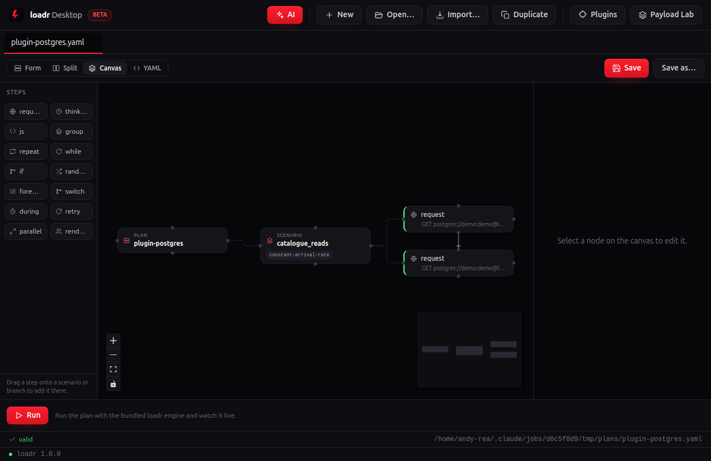
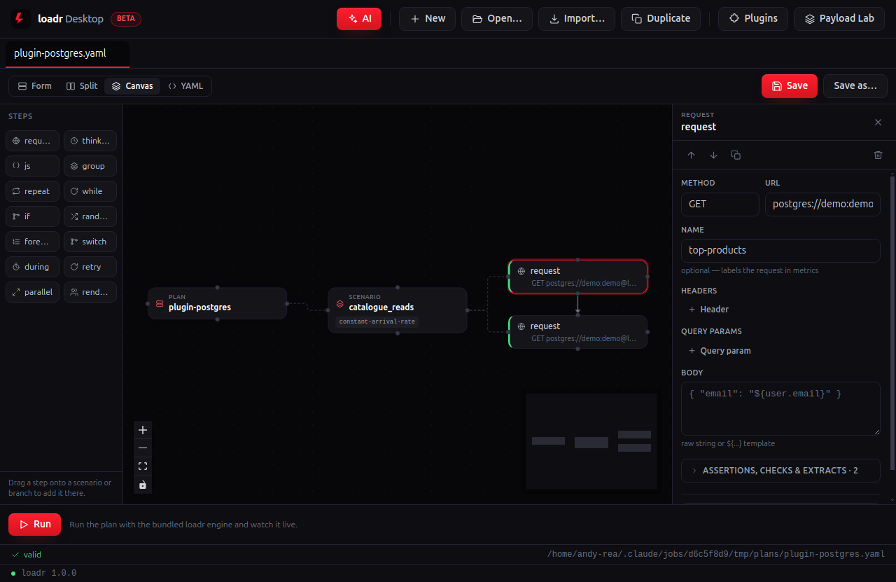
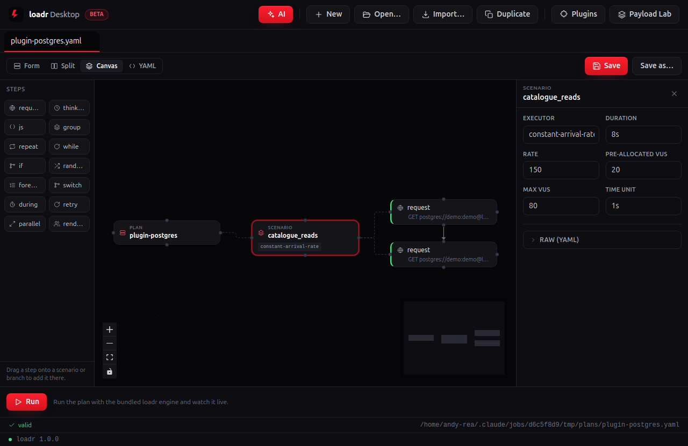
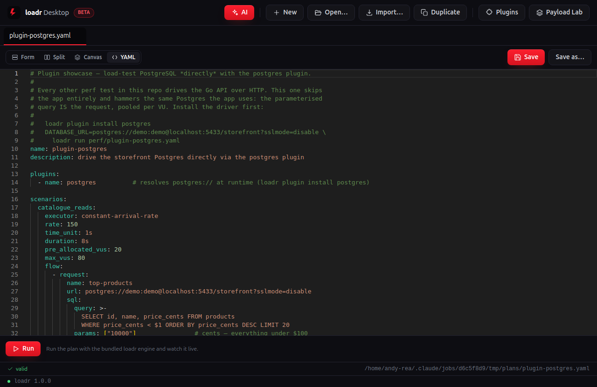
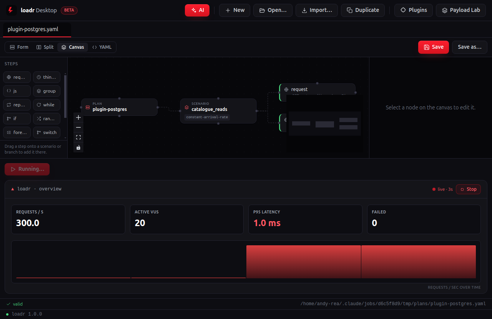
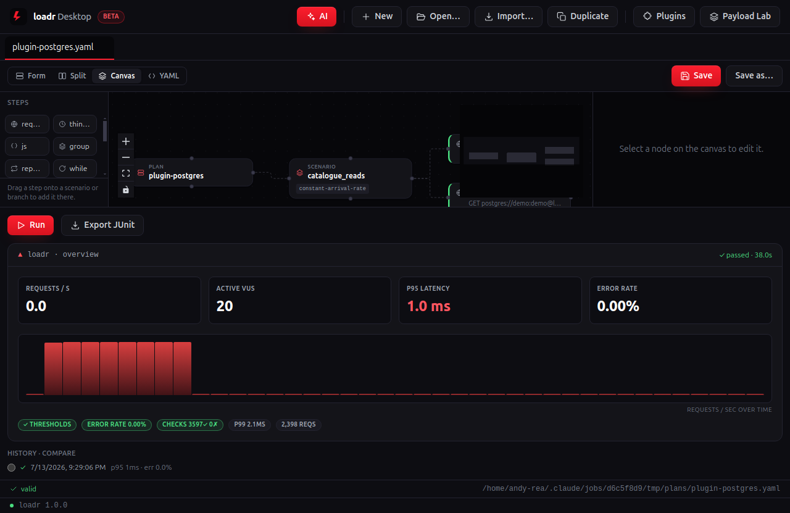
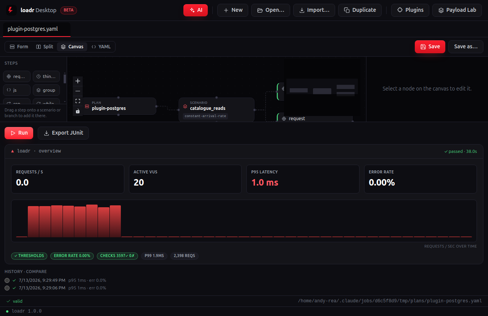

# plugin-postgres — desktop walkthrough

**No HTTP at all.** Every other demo drives the Go API; this one hammers the same Postgres the app uses, directly — the parameterised **SQL query is the request**, pooled per VU, via the installable `postgres` plugin (`loadr plugin install postgres`). Same canvas, same runner, different protocol.

| Screenshot | What's happening |
|---|---|
|  | **Open the plan into the Canvas.** The plan renders as a drag-and-drop node graph — `PLAN ▸ SCENARIO ▸` its steps — with the step palette on the left. The request nodes carry `postgres://` URLs instead of paths — the plugin resolves the scheme at runtime. |
|  | **Click a request node.** Its full GUI form opens in the inspector — method, URL, headers, body, and the checks/extracts. No YAML required. The inspector shows the DSN and the parameterised query with its `params` — a `status equals 1` check means the query succeeded. |
|  | **Click the scenario node.** The workload shape is a form too — the executor and its parameters, right where you dial the load. `constant-arrival-rate` — a fixed queries-per-second rate against the DB, open-model, like real traffic. |
|  | **Flip to YAML.** Always in sync with the canvas and byte-for-byte what `loadr run` executes in CI — `base_url` stays an `${env.BASE_URL}` reference. The desktop app is a lens over the same engine, not a re-implementation. |
|  | **Hit Run.** loadr Desktop drives the plan against the live storefront with the bundled engine while the graph stays in view; metrics stream in real time. Direct SQL throughput streams like any other run — the desktop app treats a protocol plugin exactly like HTTP. |
|  | **Read the verdict.** Headline tiles settle and the result pills report every gate — thresholds, checks, error rate and latency percentiles. **Export JUnit** is the CI report. Judged on DB-side gates: `postgres_req_duration` p95 and a checks rate — proving plugins participate in thresholds too. |
|  | **Run it again.** Each run drops into **History · compare** — pick any earlier run as a baseline and loadr Desktop diffs the two, so a regression shows up the moment it appears. |

---

Captured against the demo storefront (`make db` + `make api`) with the desktop capture rig (see [`../tools`](../tools)). Long durations are clamped so the live run finishes on-screen; the scenario shape, checks and thresholds are the plan's own. Source plan: [`../../perf/plugin-postgres.yaml`](../../perf/plugin-postgres.yaml).
