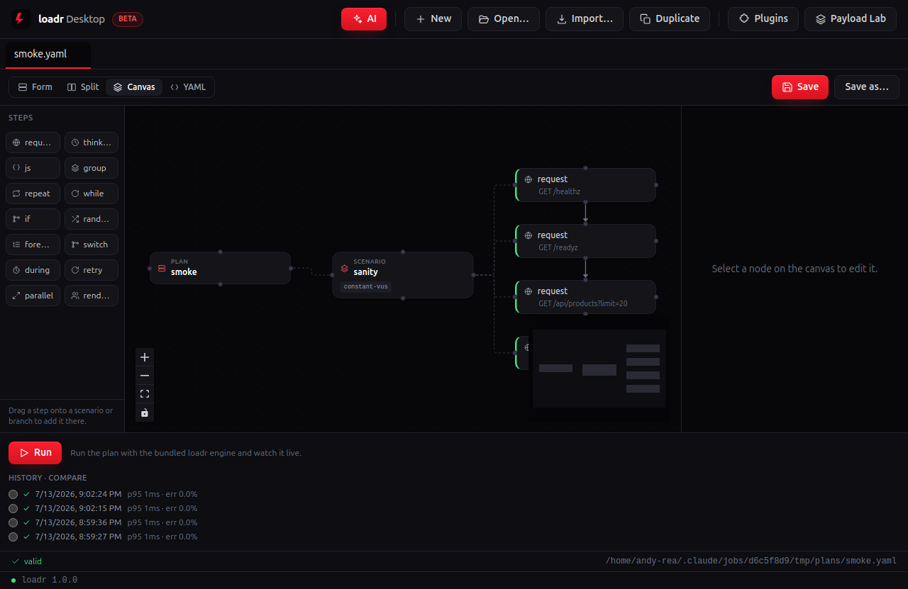
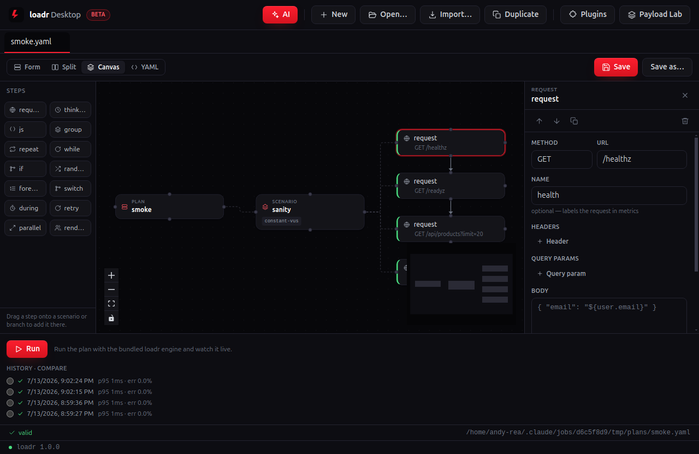
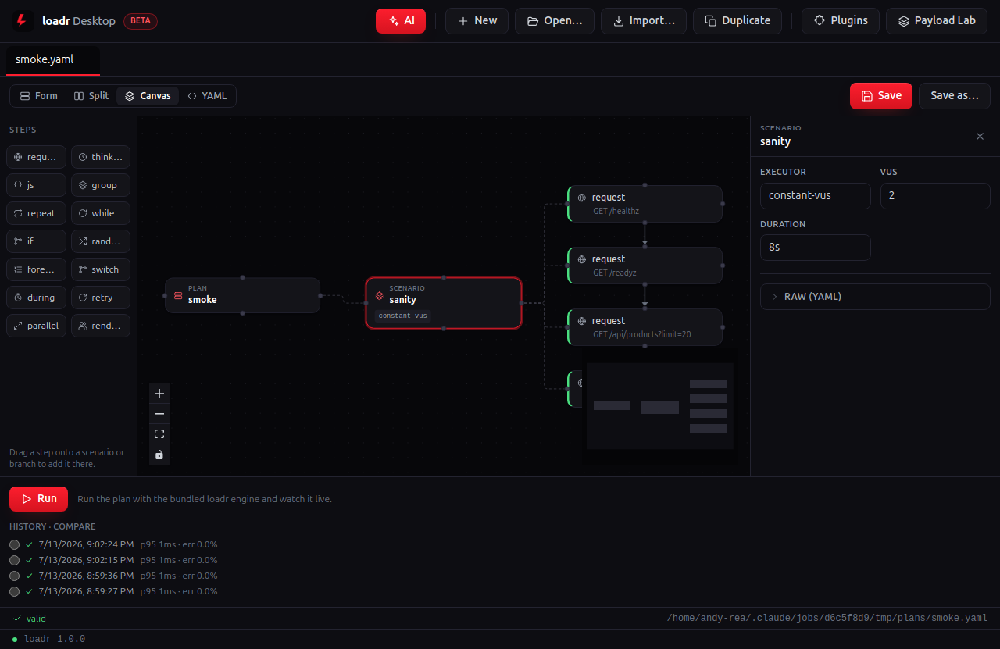
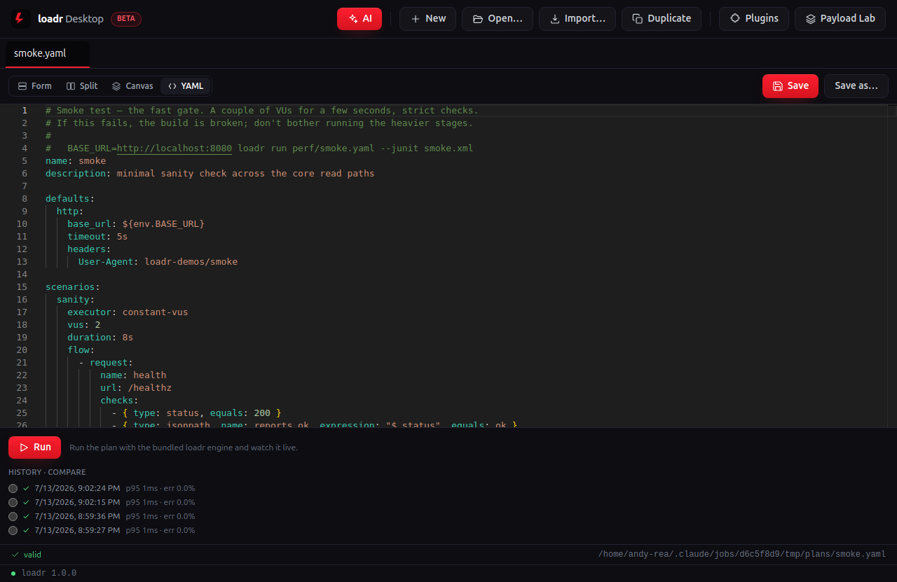
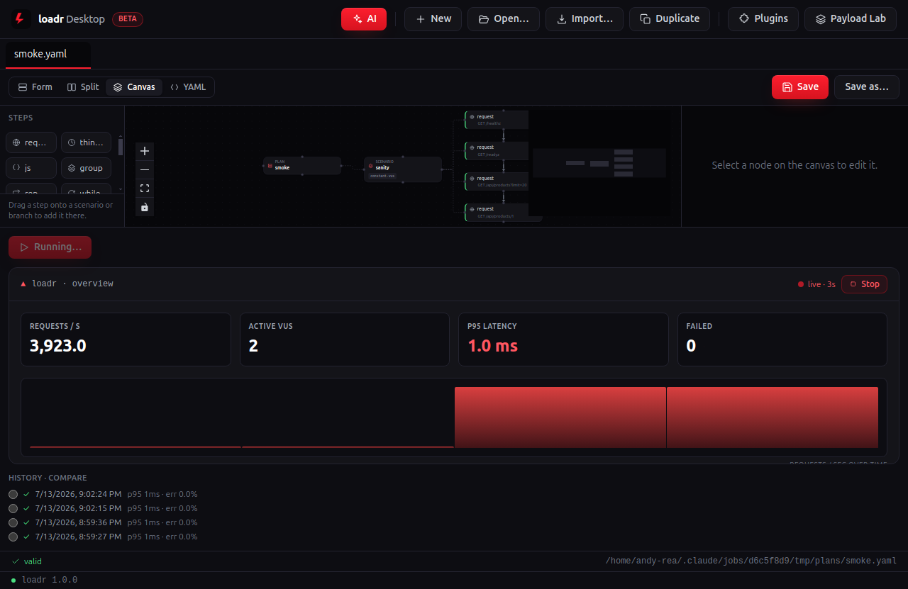
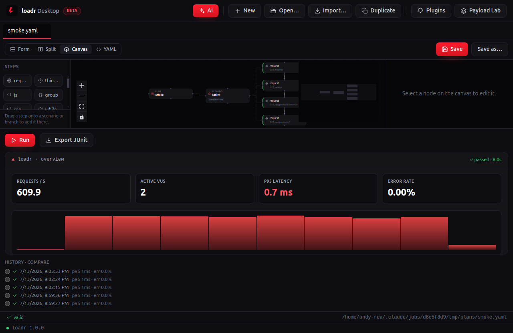
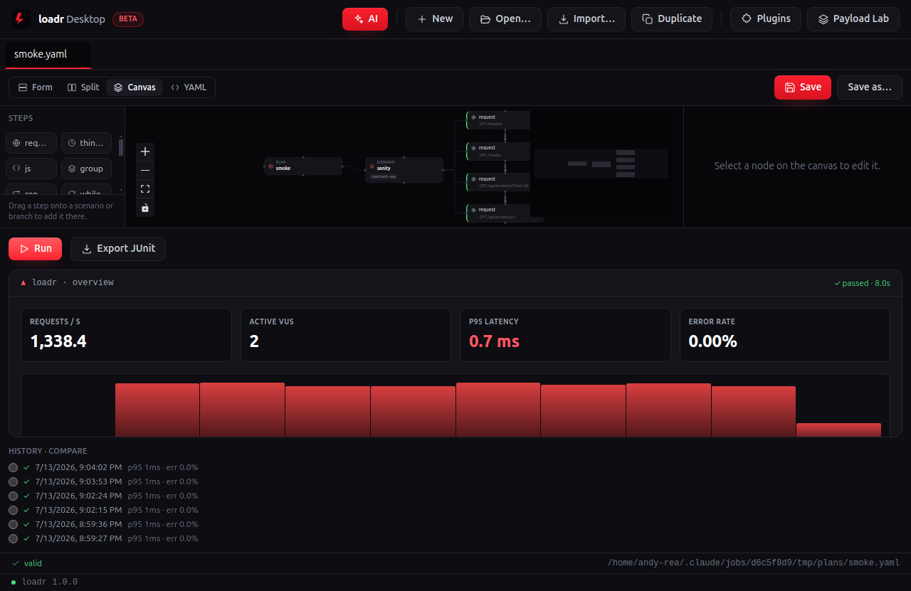

# smoke — desktop walkthrough

The **fast gate**. A couple of VUs for a few seconds across the storefront's core read paths. If `smoke` fails the build is broken and the heavier stages don't run — so it's the first thing you'd open, inspect and run in loadr Desktop.

| Screenshot | What's happening |
|---|---|
|  | **Open the plan into the Canvas.** The plan renders as a drag-and-drop node graph — `PLAN ▸ SCENARIO ▸` its steps — with the step palette on the left. Here: `sanity` on `constant-vus` feeding four read requests (`/healthz`, `/readyz`, `/api/products`, `/api/products/1`). |
|  | **Click a request node.** Its full GUI form opens in the inspector — method, URL, headers, body, and the checks/extracts. No YAML required. |
|  | **Click the scenario node.** The workload shape is a form too — the executor and its parameters, right where you dial the load. `constant-vus`, 2 VUs — barely any load, by design. |
|  | **Flip to YAML.** Always in sync with the canvas and byte-for-byte what `loadr run` executes in CI — `base_url` stays an `${env.BASE_URL}` reference. The desktop app is a lens over the same engine, not a re-implementation. |
|  | **Hit Run.** loadr Desktop drives the plan against the live storefront with the bundled engine while the graph stays in view; metrics stream in real time. The gate barely breaks a sweat: thousands of req/s at a ~1 ms p95. |
|  | **Read the verdict.** Headline tiles settle and the result pills report every gate — thresholds, checks, error rate and latency percentiles. **Export JUnit** is the CI report. **✓ passed** — zero failures, tens of thousands of checks green, sub-ms p99. |
|  | **Run it again.** Each run drops into **History · compare** — pick any earlier run as a baseline and loadr Desktop diffs the two, so a regression shows up the moment it appears. |

---

Captured against the demo storefront (`make db` + `make api`) with the desktop capture rig (see [`../tools`](../tools)). Long durations are clamped so the live run finishes on-screen; the scenario shape, checks and thresholds are the plan's own. Source plan: [`../../perf/smoke.yaml`](../../perf/smoke.yaml).
