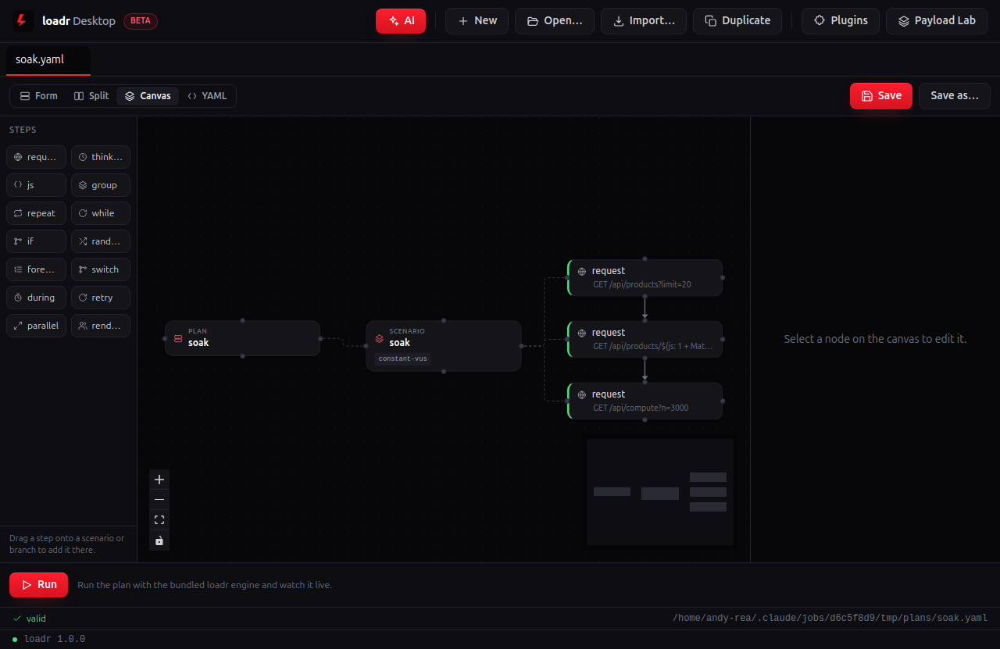
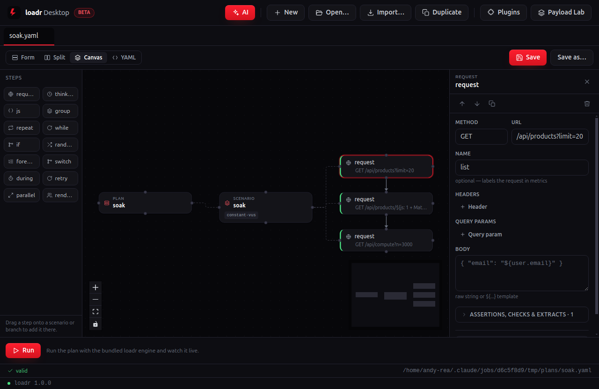
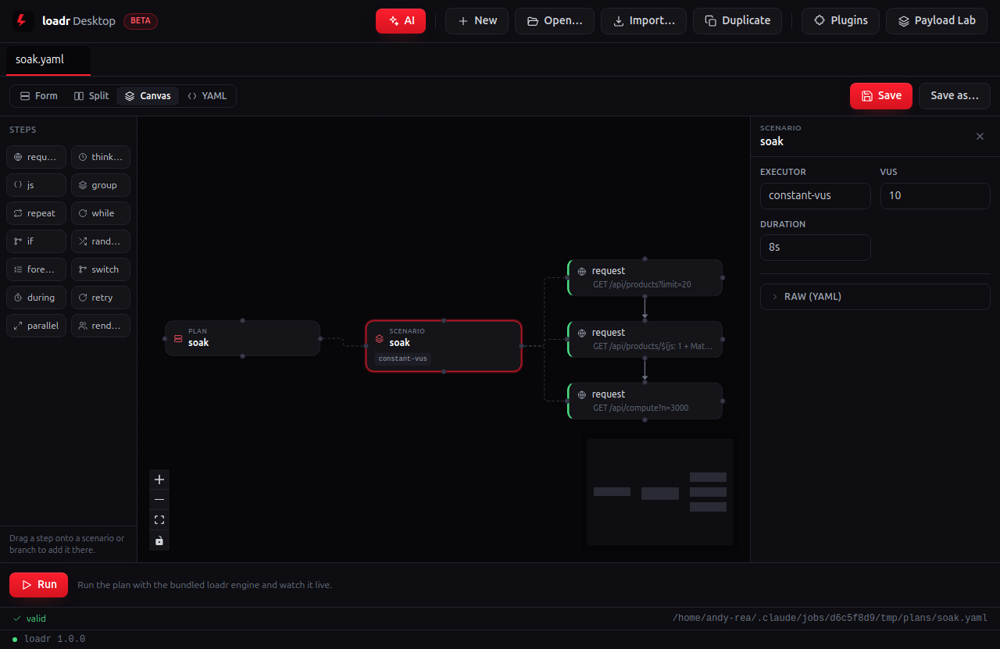
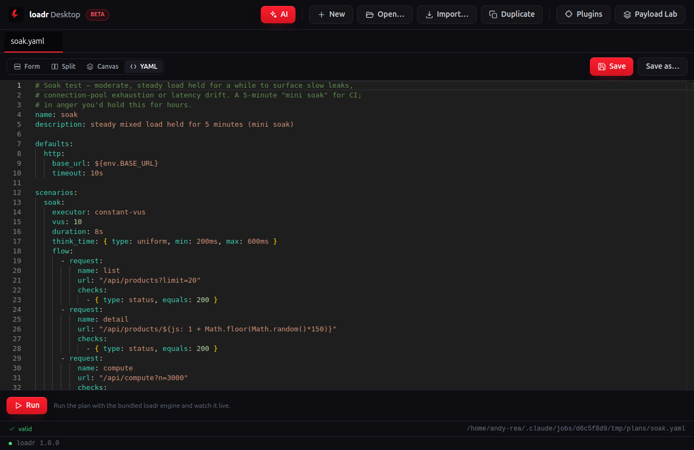
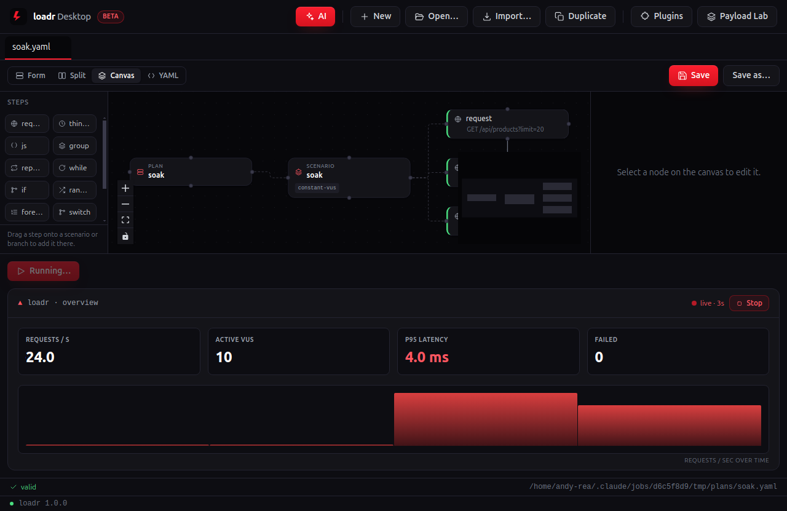
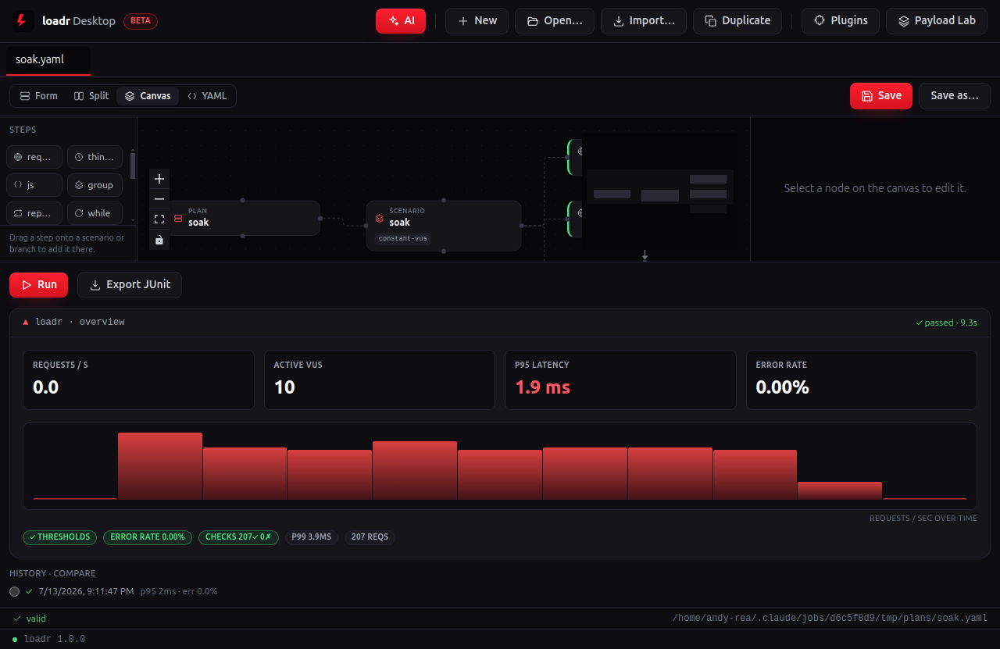
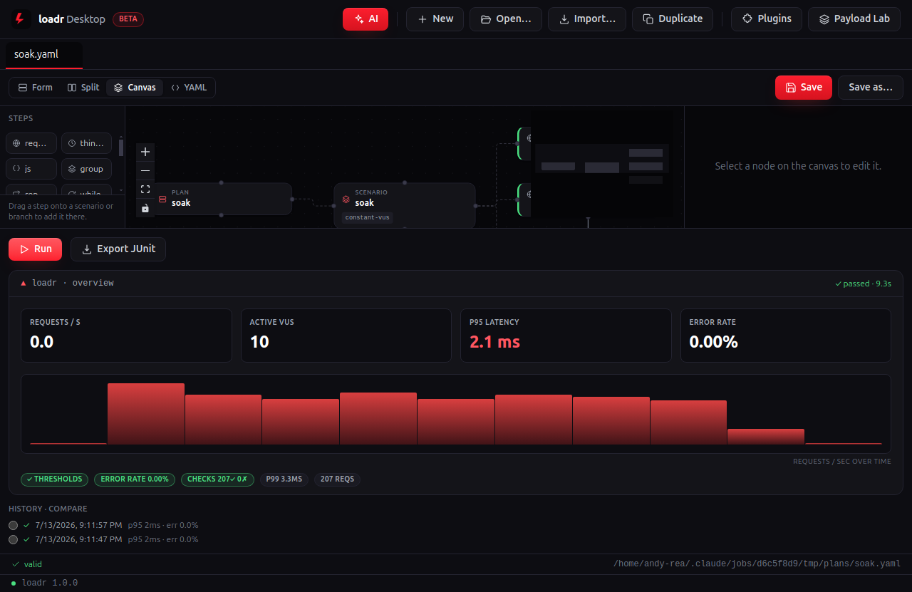

# soak — desktop walkthrough

**The long, boring one — on purpose.** A modest, constant load held for minutes. Nothing should change: if latency creeps up or memory drifts, you've found a leak that a short run would never surface.

| Screenshot | What's happening |
|---|---|
|  | **Open the plan into the Canvas.** The plan renders as a drag-and-drop node graph — `PLAN ▸ SCENARIO ▸` its steps — with the step palette on the left. |
|  | **Click a request node.** Its full GUI form opens in the inspector — method, URL, headers, body, and the checks/extracts. No YAML required. |
|  | **Click the scenario node.** The workload shape is a form too — the executor and its parameters, right where you dial the load. `constant-vus` — a small pool held flat, but for a *long* window. |
|  | **Flip to YAML.** Always in sync with the canvas and byte-for-byte what `loadr run` executes in CI — `base_url` stays an `${env.BASE_URL}` reference. The desktop app is a lens over the same engine, not a re-implementation. |
|  | **Hit Run.** loadr Desktop drives the plan against the live storefront with the bundled engine while the graph stays in view; metrics stream in real time. The point is what *doesn't* move — the metrics should stay flat the whole way. |
|  | **Read the verdict.** Headline tiles settle and the result pills report every gate — thresholds, checks, error rate and latency percentiles. **Export JUnit** is the CI report. Judged on staying flat: **avg < 200 ms and p95 < 500 ms** end to end. |
|  | **Run it again.** Each run drops into **History · compare** — pick any earlier run as a baseline and loadr Desktop diffs the two, so a regression shows up the moment it appears. |

---

Captured against the demo storefront (`make db` + `make api`) with the desktop capture rig (see [`../tools`](../tools)). Long durations are clamped so the live run finishes on-screen; the scenario shape, checks and thresholds are the plan's own. Source plan: [`../../perf/soak.yaml`](../../perf/soak.yaml).
